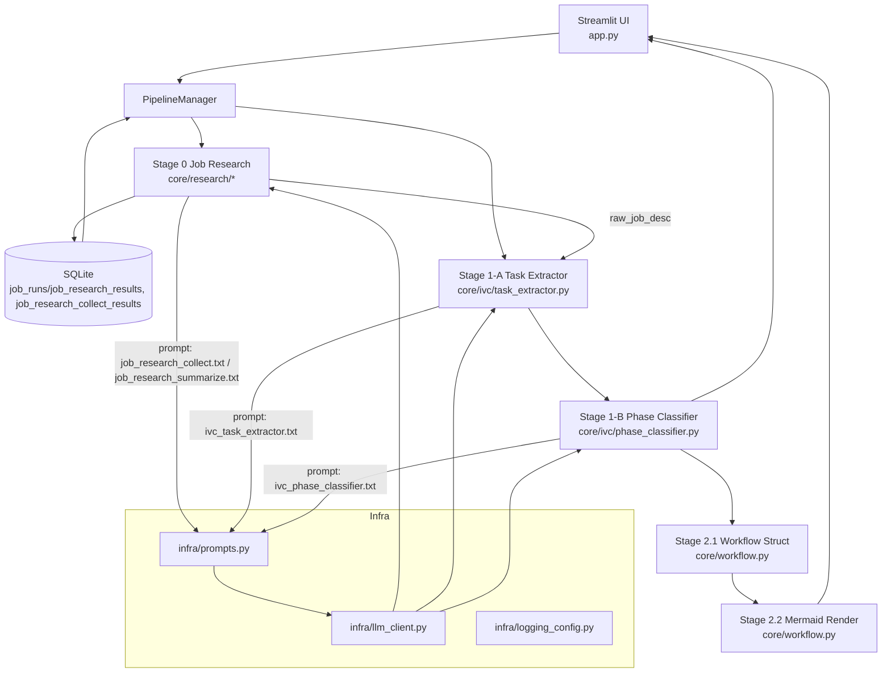

# Logic Flow (Stage 0~1 PoC)
> Last updated: 2025-12-02 (by AX Agent Factory Codex)

## 1) End-to-End 개요
- 입력: 회사명, 직무명, (선택) 수동 JD 텍스트.
- PipelineManager가 JobRun 생성 → Stage 0 실행 → Stage 1 실행(선택) → Stage 2(워크플로우 구조화/머메이드) 실행(추가 예정) → UI 탭에서 결과 확인.
- LLM 실패/키 부재 시에도 스텁으로 이어서 결과를 보여준다.

## 2) Stage별 상세 표

| Stage | Input 모델 | 사용 프롬프트/LLM | 처리 로직 | Output 모델 |
| --- | --- | --- | --- | --- |
| 0.1 Collect | `JobRun(company_name, job_title)` + optional `manual_jd_text` | `prompts/job_research_collect.txt` → `call_job_research_collect` (web_search, 기본 `gemini-2.5-flash`, 키 없으면 스텁) | JSON만 허용 → `_clean_json_text`/`_normalize_json_text` → 실패 시 `_stub_job_research_collect` | `JobResearchCollectResult(raw_sources[])` + UI용 `llm_raw_text/llm_error` |
| 0.2 Summarize | `JobRun`, `raw_sources`(0.1), optional `manual_jd_text` | `prompts/job_research_summarize.txt` → `call_job_research_summarize` (기본 `gemini-2.5-flash`, 키 없으면 스텁) | JSON만 허용 → `_clean_json_text`/`_normalize_json_text` → 실패 시 `_stub_job_research_summarize` | `JobResearchResult(raw_job_desc, research_sources)` + UI용 `llm_raw_text/llm_error` |
| 1-A. IVC Task Extractor | `JobInput(job_meta, raw_job_desc)` | `prompts/ivc_task_extractor.txt` → `call_task_extractor` (기본 Gemini, 키 없으면 스텁) | JSON 하나만 허용, 코드블록 금지, sanitizer로 경미한 오류 수정 → `parse_task_extraction_dict` | `TaskExtractionResult(task_atoms[], llm_raw_text/llm_error)` |
| 1-B. IVC Phase Classifier | `IVCTaskListInput(job_meta, task_atoms)` | `prompts/ivc_phase_classifier.txt` → `call_phase_classifier` (기본 Gemini, 키 없으면 스텁) | JSON 하나만 허용, 코드블록 금지, sanitizer로 경미한 오류 수정 → `parse_phase_classification_dict` | `PhaseClassificationResult(ivc_tasks[], phase_summary, task_atoms, llm_raw_text/llm_error)` |
| 2.1 Workflow Struct | PhaseClassificationResult (job_meta, ivc_tasks, task_atoms, raw_job_desc) | `prompts/workflow_struct.txt` → `call_workflow_struct` | JSON-only, sanitizer로 경미한 오류 수정 → `WorkflowPlan` | `WorkflowPlan(stages, streams, nodes, edges, entry_points, exit_points, llm_raw_text/llm_error)` |
| 2.2 Mermaid Render | WorkflowPlan | `prompts/workflow_mermaid.txt` → `call_workflow_mermaid` | JSON-only, Notion 호환 Mermaid 코드 생성 → 파싱 | `MermaidDiagram(mermaid_code, warnings, llm_raw_text/llm_error)` |

## 3) 실행 시나리오 (UI 관점)
- 사이드바 입력 → `0. Job Research 실행` 버튼: Stage 0 단독 실행 후 DB/세션에 저장.
- 사이드바 입력 → `0~1단계 실행` 버튼: Stage 0 실행 후 결과를 이어받아 Stage 1 연속 실행.
- Stage 0 탭: `raw_job_desc`, `research_sources`, 0.1 `raw_sources`, LLM raw/error 확인.
- Stage 1 탭: Task Extractor 결과(task_atoms)와 Phase Classifier 결과(ivc_tasks, phase_summary) 분리 표시.

## 4) 공통 가드레일
- 환경변수: `GOOGLE_API_KEY`(없으면 스텁), `GEMINI_MODEL`(기본 gemini-2.5-flash), `AX_DB_PATH`(기본 data/ax_factory.db).
- JSON 응답 규칙: **하나의 JSON 객체만**, 마크다운 코드블록/서술 금지, 허용된 top-level 키만 사용.
- 에러 처리: JSON 파싱 실패 시 InvalidLLMJsonError 발생 → 상위에서 스텁 사용 또는 오류 표시. 로그와 UI에서 raw/error를 함께 노출.
